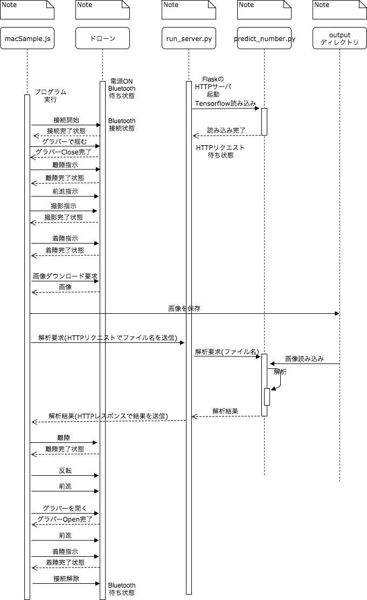
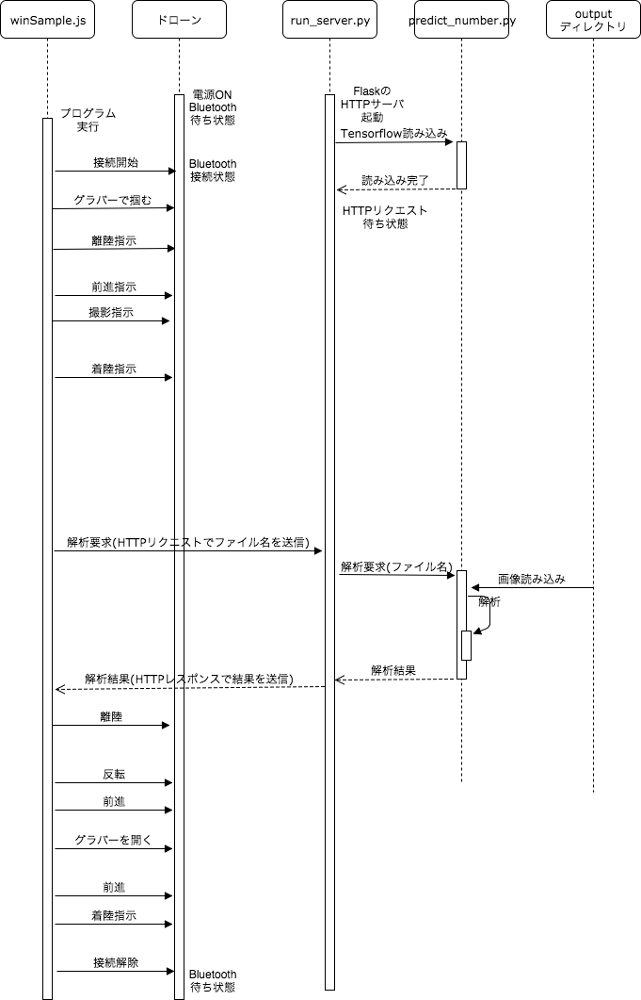

# ドローン

Parrot Mambo Missionを使って遊びます

## 内容

+ 環境構築
+ ドローンを動かしてみる

## 細かい環境構築

#### gitコマンドを使えるようにしましょう

+ Macならターミナル
+ Windowsなら[git bash](https://git-for-windows.github.io/)

#### githubのアカウントを作りましょう

[こちら](https://github.com/)

#### Pythonをインストールしましょう

([Anacondaでインストール](https://www.anaconda.com/download/#macos))

#### Node.jsをインストールしましょう

##### Macの場合

nodebrewなどを使うと良いと思います

##### Windowsの場合

[こちら](https://nodejs.org/ja/)などからインストーラをダウンロードしてインストールする


## Node.jsのライブラリを準備しましょう

### 背景・目的

+ 今回はドローンはNode.jsのライブラリを使って動かしています
+ 使用するライブラリは、dronejsというライブラリですが、そのライブラリはBluetoothを使うための幾つかのライブラリに依存しているため、それらも合わせてインストールする必要があります
+ この準備が整えば、ドローンとパソコンの通信ができるようになり、ドローンを飛ばしたり、アームを動かしたりできるようになります

#####  Windowsの場合の準備方法

npm, git, python(2.7)コマンドを使えるターミナル(git bash, コマンドプロンプトなど)を用意してください

コマンドを使えない場合は、インストールの手順が失敗しているか、PATH環境変数の設定ができていない可能性があります

```
npm install --global windows-build-tools # Python2.7などNode.jsのライブラリに必要なものを全て用意してくれるコマンド
npm install bluetooth-hci-socket
git clone https://github.com/hiko2msp/play_with_parrot_mambo # サンプルプログラムをダウンロードします
cd play_with_parrot_mambo
npm install # サンプルプログラムを動かすために必要なNode.jsのライブラリをインストールします。
cd node_modules # Node.jsのライブラリがインストールされるディレクトリに移動します
git clone https://github.com/hiko2msp/DroneJS.git dronejs # dronejsを改造したプログラムをnode_modulesの下にdronejsという名前で配置します
cd ../
```

##### Mac(High Sierra未満のバージョン)の場合

npm, git, python(2.7)コマンドを使えるターミナルを用意してください

コマンドを使えない場合は、インストールの手順が失敗しているか、PATH環境変数の設定ができていない可能性があります

```
xcode-select --install # Already instlaledという文字が表示されればOKです
conda create -n py2.7 python=2.7 # Anacondaのcondaコマンドを使って、python2.7の環境を作ります
source activate py2.7 # python2.7の環境に切り替えます
git clone https://github.com/hiko2msp/play_with_parrot_mambo # サンプルプログラムをダウンロードします
cd play_with_parrot_mambo
npm install # サンプルプログラムを動かすために必要なNode.jsのライブラリをインストールします。
cd node_modules # Node.jsのライブラリがインストールされるディレクトリに移動します
git clone https://github.com/hiko2msp/DroneJS.git dronejs
cd ../
source deactivate py2.7 # 最後にPython2.7の環境から元の環境に戻る
```

##### Mac(High Sierra)の場合


```
xcode-select --install # Already instlaledという文字が表示されればOKです
conda create -n py2.7 python=2.7 # Anacondaのcondaコマンドを使って、python2.7の環境を作ります
source activate py2.7 # python2.7の環境に切り替えます
git clone https://github.com/hiko2msp/play_with_parrot_mambo # サンプルプログラムをダウンロードします
cd play_with_parrot_mambo
npm install git+https://github.com/PolideaInternal/noble.git#macos_highsierra
npm install # サンプルプログラムを動かすために必要なNode.jsのライブラリをインストールします。
cd node_modules # Node.jsのライブラリがインストールされるディレクトリに移動します
git clone https://github.com/hiko2msp/DroneJS.git dronejs
cd ../
source deactivate py2.7 # 最後にPython2.7の環境から元の環境に戻る
```


##### Node.jsのライブラリが準備できたかどうかの確認

ドローンの名前を確認できればOKです

+ ドローンの電源を入れる
+ 緑色のランプが点滅していることを確認する
+ 下記コマンドを打って、名前を確認する

  ```
  $ cd play_with_parrot_mambo
  $ node find.js
  ------1台目: 
  a28118342ab84ddb85aac7271f72ddb7 Mambo_546341
  1: Mambo_546341 (a28118342ab84ddb85aac7271f72ddb7), RSSI -42
  ```

  上記のうち、'Mambo_546341'がドローンの名前となります

## サンプルプログラムを動かしましょう

#### 飛行テスト

飛んで着陸するだけのプログラムです

+ 実行する前にtestFlight.jsの中にドローンの名前を指定してください
+ 下記コマンドを実行すると、動きます

  ```
  $ node testFlight.js
  ```

#### グラバーのテスト

掴んで離すだけのプログラムです

+ 実行する前にtestGrab.jsの中にドローンの名前を指定してください
+ ドローンにグラバーを装着してください
+ 下記コマンドを実行すると、動きます


  ```
  $ node testGrab.js
  ```


## 画像の解析のプログラムを実行しましょう

#### 背景・目的

+ 画像の解析のプログラムを実行します
+ 画像の解析にはPythonのディープラーニング用のライブラリであるTensorflowとKerasを使用しています
  + KerasはTensorflowを使いやすくするライブラリです
+ Pythonのバージョンは、3.5が好ましいですが、2.7や3.6でもプログラムが動けば問題ありません。OSによっては、PythonのバージョンによってTensorflowなどのライブラリをインストールできないケースがあります。その場合はPythonのバージョンを変えてからライブラリのインストールをしてみてください。

#### その他の情報

+ AnacondaでPythonをインストールをした時にPython3.5に切り替える方法(必要に応じて行ってください)
  + ターミナルで下記コマンドを打ちましょう

    ```
    $ conda create -n py3.5 python=3.5 anaconda # python3.5を動かせる環境をパソコンに作ります(1回実行すればパソコンに環境ができるので、何度も実行する必要はありません)
    $ source activate py3.5 # python3.5に切り替える
    ```


#### 画像解析に必要なライブラリのインストール

画像解析を行うために必要なPythonのライブラリをインストールします

```
$ cd play_with_parrot_mambo # サンプルプログラムがあるディレクトリに移動(requirements.txtがあるため)
$ pip install --upgrade --ignore-installed -r requirements.txt
```

+ こちらに失敗する場合は、Pythonのバージョンに問題があるか、依存ライブラリのバージョンに問題があります
+ requirements.txtに書いてあるバージョン指定の部分を消すか、別のバージョンを指定することでインストールするバージョンを変えることができます
+ TensorflowはOSによってインストールしづらいライブラリですので、Tensorflowの公式ページでインストール方法を確認すると確実にインストールできます。

#### 画像解析プログラムを動かしてみる

上記の準備ができたら、画像解析プログラムを動かせるはずです。

下記のコマンドで実行してみましょう

```
$ python predict_number.py output/0.jpg model.h5 
```

下のような出力がターミナルに出るはずです。

```
Using TensorFlow backend.
2017-12-25 22:28:34.077442: W tensorflow/core/platform/cpu_feature_guard.cc:45] The TensorFlow library wasn't compiled to use SSE4.1 instructions, but these are available on your machine and could speed up CPU computations.
2017-12-25 22:28:34.077489: W tensorflow/core/platform/cpu_feature_guard.cc:45] The TensorFlow library wasn't compiled to use SSE4.2 instructions, but these are available on your machine and could speed up CPU computations.
2017-12-25 22:28:34.077500: W tensorflow/core/platform/cpu_feature_guard.cc:45] The TensorFlow library wasn't compiled to use AVX instructions, but these are available on your machine and could speed up CPU computations.
2017-12-25 22:28:34.077510: W tensorflow/core/platform/cpu_feature_guard.cc:45] The TensorFlow library wasn't compiled to use AVX2 instructions, but these are available on your machine and could speed up CPU computations.
2017-12-25 22:28:34.077520: W tensorflow/core/platform/cpu_feature_guard.cc:45] The TensorFlow library wasn't compiled to use FMA instructions, but these are available on your machine and could speed up CPU computations.
/Users/job2/.pyenv/versions/anaconda3-2.5.0/lib/python3.5/site-packages/keras/models.py:288: UserWarning: Error in loading the saved optimizer state. As a result, your model is starting with a freshly initialized optimizer.
  warnings.warn('Error in loading the saved optimizer '
[2]
Exception ignored in: <bound method BaseSession.__del__ of <tensorflow.python.client.session.Session object at 0x126ec9710>>
Traceback (most recent call last):
  File "/Users/job2/.pyenv/versions/anaconda3-2.5.0/lib/python3.5/site-packages/tensorflow/python/client/session.py", line 587, in __del__
TypeError: 'NoneType' object is not callable
```

+ 上記はエラーが出ていますが、`[2]`という文字列が出力されているので、正しく計算できています
+ これは、`output/0.jpg`の画像ファイルに2という文字が写っていることを意味しています
+ コマンド引数で解析ファイルを指定する場合、下記のように`,`区切りで複数指定もできます

  ```
  $ python predict_number.py output/0.jpg,output/1.jpg model.h5
  Using TensorFlow backend.
  2017-12-25 22:30:49.577607: W tensorflow/core/platform/cpu_feature_guard.cc:45] The TensorFlow library wasn't compiled to use SSE4.1 instructions, but these are available on your machine and could speed up CPU computations.
  2017-12-25 22:30:49.577645: W tensorflow/core/platform/cpu_feature_guard.cc:45] The TensorFlow library wasn't compiled to use SSE4.2 instructions, but these are available on your machine and could speed up CPU computations.
  2017-12-25 22:30:49.577653: W tensorflow/core/platform/cpu_feature_guard.cc:45] The TensorFlow library wasn't compiled to use AVX instructions, but these are available on your machine and could speed up CPU computations.
  2017-12-25 22:30:49.577659: W tensorflow/core/platform/cpu_feature_guard.cc:45] The TensorFlow library wasn't compiled to use AVX2 instructions, but these are available on your machine and could speed up CPU computations.
  2017-12-25 22:30:49.577665: W tensorflow/core/platform/cpu_feature_guard.cc:45] The TensorFlow library wasn't compiled to use FMA instructions, but these are available on your machine and could speed up CPU computations.
  /Users/job2/.pyenv/versions/anaconda3-2.5.0/lib/python3.5/site-packages/keras/models.py:288: UserWarning: Error in loading the saved optimizer state. As a result, your model is starting with a freshly initialized optimizer.
  warnings.warn('Error in loading the saved optimizer '
  [2, 3]
  ```

## Node.jsからPythonを呼び出してみましょう

#### 背景・目的

+ Node.jsは画像処理がしやすいプログラミング言語ではありません。ですので、今回はNode.jsからPythonのプログラムに画像処理を委譲してみます。

+ 処理の流れ
  + Node.jsとPythonの間をやりとりする方法はいくつかありますが、今回はHTTP通信を使います
  + PythonでHTTPリクエストを受け取るサーバを立ち上げます(FlaskというWebフレームワークを使っています)
  + Node.jsのプログラムからは、Pythonのサーバに対して画像処理をしてくださいとHTTPリクエストを投げます。その時に、画像のパスも送ります
  + Pythonのサーバは、リクエストを受けると、画像のパスから画像を探してきて、処理し、結果をHTTPレスポンスでNode.jsに返します
  + Node.js側はHTTPレスポンスを受けると、そのレスポンスから結果を読み取り、出力に表示します


+ 解析サーバが必要な理由
  + Pythonの解析にはKerasとTensorflowというディープラーニングのフレームワークを使用しています
  + Tensorflowは起動に時間がかかります
  + Node.jsからPythonのプロセスを実行することもできますが、ドローンとの接続が一定時間以上ない場合、ドローンとのコネクションが切れてしまいます
  + そのため、起動のオーバーヘッドの時間を、事前にサーバを立ち上げる際に処理しておくことで、解析の際にできるだけ短い時間で解析を行えるようにしております
  + もちろん、画像解析の処理速度を高速化すれば、Node.jsからPythonのプロセスを実行することも可能です。

#### 実行方法

+ 2つのターミナルを立ち上げます(Windowsの場合、git bashを2つ立ち上げます)
+ 両方のターミナルのCWD(カレントワーキングディレクトリ)をplay_with_parrot_mamboにします
+ 1つ目のターミナルで、Pythonの解析サーバを立ち上げます
  
  ```
  $ python run_server.py
  Using TensorFlow backend.
   * Running on http://127.0.0.1:5000/ (Press CTRL+C to quit)
  ```

  上記の状態になるまで待ってください

+ 2つ目のターミナルでNode.jsから画像の解析のリクエストを解析サーバに送り、結果をNode.jsのプロセス上で表示します

  ```
  $ node testAnalyze.js
  start
  output/0.jpg,output/1.jpg
  --------------------------------------------------------
  [ 2, 3 ]
  --------------------------------------------------------
  ```

  上記のような解析結果が得られるはずです


## チーム戦用のプログラムを実行してみましょう

#### Macの場合

+ 別のターミナルで画像処理用のPythonのサーバを実行する

  ```
  python run_server.py
  ```

+ macSample.jsにドローンの名前を追記する(14行目を下記のように修正します)
  ```
  // あなたのMamboの名前をセットしてください。
  var DRONE_NAME = "Mambo_546341";
  ```

+ macSample.jsを動かす

  ```
  $ node macSample.js
  ```



#### Windowsの場合

+ 別のターミナルで画像処理用のPythonのサーバを実行する

  ```
  python run_server.py
  ```

+ winSample.jsにドローンの名前を追記する(14行目を下記のように修正します)
  ```
  // あなたのMamboの名前をセットしてください。
  var DRONE_NAME = "Mambo_546341";
  ```

+ winSample.jsを動かす

  ```
  $ node winSample.js
  ```



## その他参考資料

Windows

https://github.com/hiko2msp/play_with_parrot_mambo

(1)Git Bash
http://gitforwindows.org
・ダウンロード
・Search Git Bash
・Open Git Bash
・git --version

(2)Node
https://nodejs.org/ja/
・ダウンロード
・node -v
・npm -v

(3) ソースのダウンロードとbuild toolの構築
管理者権限@Git Bash(右クリック)
$ git clone https://github.com/hiko2msp/play_with_parrot_mambo.git
$ cd play_with_parrot_mambo
$ npm install --global --production windows-build-tools $ npm install $ npm install git clone https://github.com/hiko2msp/DroneJS.git
$ npm install bluetooth-hci-socket
$ mv DroneJS node_modules/dronejs
$ node find.js

(4)Python環境の設定
$ conda create -n py3.5 python=3.5 anaconda
$ source activate py3.5
$ pip install --upgrade --ignore-installed -r requirements.txt

(5)ZADIG
http://zadig.akeo.ie
・ダウンロード
・Optionメニュー
・List All Devices
・CSR8510 A10
・Win USB
・Replace Driver

(6)ドローンを飛ばす
$ node winSample.js

MAC

(0)Pythonを入れる前の設定
$ xcode-select --install

(1)Node
https://nodejs.org/ja/
$ node -v
$ npm -v  

(2)Git
https://git-scm.com
$ git  --version


